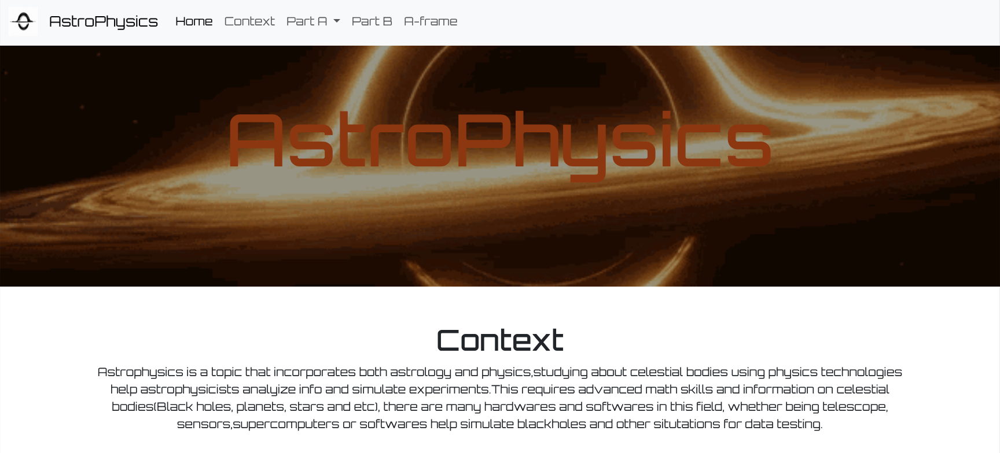

# Entry 6
##### 5/10/26

## Context
I started creating my MVP product based on my wireframe and I took inspiration from the SHABR project, I added components such as home page because that's one of the thing I liked about the SHABR project, It was extremely fun to create a project based on what I liked and enjoyed, here's an image and link to the Preview of my [Website](https://wenjiec0313.github.io/sep10-freedom-project/), 


Although it was fun it was also challenging, creating a a-frame of my future technology to creating the code of my project.

## Process 
creating my a-frame toom a lot of time, making sure each shape is in the right spot, even when I found this rotation difficult I still attempted  to do it and evenutally I got a product I liked, It was quite difficult to turn X, Y, Z rotation + positioning but evenutally I got the hang of it after a little experimenting 
```html
<a-scene>


      <a-cylinder position="7.85 11.5 -3" rotation="0 0 -75" radius="1.1" height="2" color="black" ></a-cylinder>
       <a-cylinder position="2 10 -3" rotation="0 0 -75" radius="1" height="10" color="white" ></a-cylinder>
        <a-cylinder position="2 10 -3" rotation="0 0 -75" radius="1" height="10" color="white" ></a-cylinder>
         <a-cylinder position="2 10 -3" rotation="0 0 -75" radius="1" height="10" color="white" ></a-cylinder>

 <a-cylinder position="-3 8.7 -3" rotation="0 0 -75" radius="0.75" height="7.5" color="white" ></a-cylinder>
<a-cylinder position="-8 7.4 -3" rotation="0 0 -75" radius="0.5" height="5" color="black" ></a-cylinder>
  <a-cylinder position="-2 3 -3" rotation="0 0 25" radius="0.5" height="10" color="white" ></a-cylinder>
  <a-cylinder position="-6 3 -3" rotation="0 0 -25" radius="0.5" height="10" color="white" ></a-cylinder>
  <a-cylinder position="-7.5 0 -3" rotation="0 0 -25" radius="0.75" height="1" color="black" ></a-cylinder>
  <a-cylinder position="-0.5 0 -3" rotation="0 0 25" radius="0.75" height="1" color="black" ></a-cylinder>
   <a-cylinder position="-0.5 10.5 -3" rotation="0 0 0" radius="0.35" height="1" color="black" ></a-cylinder>
    <a-cylinder position="-5 3 -1" rotation="0 75 -25" radius="0.5" height="10" color="white" ></a-cylinder>
    <a-cylinder position="-5.35 0 0.5" rotation="0 50 -25" radius="0.75" height="1" color="black" ></a-cylinder>
      <a-cylinder position="-0.5 11 -3" rotation="0 0 -75" radius="0.5" height="5" color="white" ></a-cylinder>
      <a-cylinder position="2.25 11.75 -3" rotation="0 0 -75" radius="0.5" height="0.75" color="black" ></a-cylinder>
       <a-cylinder position="0.75 12 -3" rotation="0 0 0" radius="0.35" height="0.5" color="black" ></a-cylinder>
         <a-cylinder position="0.5 12.5 -3" rotation="0 0 -75" radius="0.5" height="3.5" color="white" ></a-cylinder>
          <a-cylinder position="2.45 13 -3" rotation="0 0 -75" radius="0.5" height="0.5" color="black" ></a-cylinder>


  <a-plane position="0 0 -4" rotation="-90 0 0" width="100" height="67" color="#7BC8A4"></a-plane>
      <a-sky color="#d2e08b"></a-sky>

</a-scene>

```
Then I was struggling to decide a second bootstrap component to use but I finally decided on using a toast to redirect other students to my SEP portfolio to see my other projects.
```html
<button type="button" class="btn btn-primary" id="liveToastBtn">Funny Button</button>

<div class="toast-container position-fixed bottom-0 end-0 p-3">
  <div id="liveToast" class="toast" role="alert" aria-live="assertive" aria-atomic="true">
    <div class="toast-header">
      <strong class="me-auto">Important Notification</strong>
      <small>Just now</small>
      <button type="button" class="btn-close" data-bs-dismiss="toast" aria-label="Close"></button>
    </div>
    <div class="toast-body">
      If you enjoyed this project please consider checking out my other <a href="https://wenjiec0313.github.io/">projects!</a>
    </div>
  </div>
</div>

```
## EDP
I'm on step 6-8, I'm almost done testing my project and focused my time on improving it as needed based on the feedback I received from my peers/classmates, and we're about to present our projects therefore making it also step 8.

## Skills

### How to learn
This process of creating my project was a great journey of learning and working along the process as I learnt more about how to use my tool along the way and I was exposed to using new codes, overall this project helped me learned more about coding as a whole

### Time management
Time management was extremely important last week, as we had to create plan on what we're going to do for each day, and If you weren't able to complete each day's goal It was important to find a way to make it up so you don't fall behind on your plan or your plan would slowly collapse as work begins to pile up on you.


[Previous](entry05.md) | [Next](entry07.md)

[Home](../README.md)
